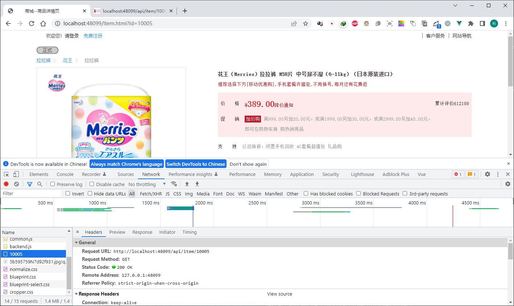
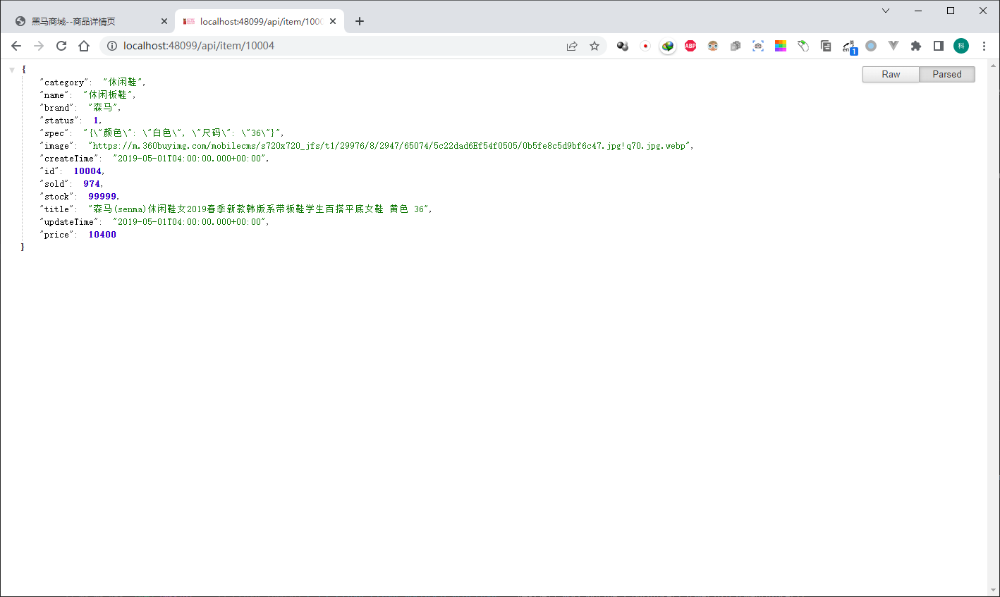

# 多级缓存

## 功能描述
浏览器访问网站数据，流量的规则为：

浏览器->nginx->redis->apache->mysql,具体功能是由于redis的性能远高于apache，所以最好是用nginx框架调用rendis，而不是项目调用nginx，能显著提高并发性能！

具体资料查询路径：

```bash
第4阶段—中间键&服务框架
1、微服务开发框架SpringCloud+RabbitMQ+Docker+Redis+搜索+分布式史上最全面的微服务全技术栈课程
高级篇
```

## 实现描述

### 总述
除了apache，其余运行在docker容器，用docker-compose部署的。

```bash
# 1. nignx本地缓存方式是openresty，所以这里判断openresty是否缓存！
浏览器访问->nginx(48099)->openresty(8081)

# 2. openresty没有，找redis！
浏览器访问->nginx(48099)->openresty(8081)->redis(8008)

# 3. redis没有，找Apache服务，Apache调用mysql.
浏览器访问->nginx(48099)->openresty(8081)->redis(8008)->apache(8091,8092)->mysql(3306)

# 4. canal将得到的结果广播给openresty和redis.

```
### 具体步骤

- `my.cnf` 内容如下：

```bash
[mysqld]
skip-name-resolve
character_set_server=utf8
datadir=/var/lib/mysql
server-id=1000
log-bin=/var/lib/mysql/mysql-bin
binlog-do-db=heima

```

- redis配置请看文件压缩包: `redisContain.zip`

```bash
# 主要是开启aof
appendonly yes
```

- 导入数据到 `mysql`

```mysql
<!-- 密码:root -->
mysql -h 127.0.0.1 -uroot -p

source configCanal.sql
source item.sql
```

- 启动服务

```bash
# 启动docker服务
docker-compose up -d

# 关闭
docker-compose down

# 启动自定义服务，默认服务器是apache，端口是8091和8092
# visual code运行多实例需要参数如下：
"vmArgs": "-Dserver.port=8092"

```

PS: 可能存在预热较慢，运行1分钟后正常！


